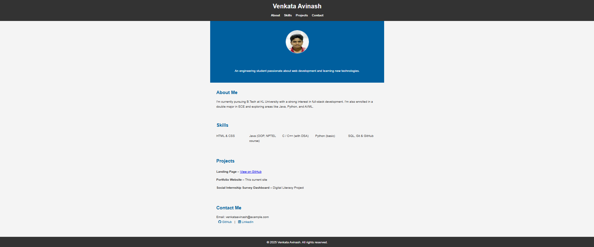

# OIBSIP - Web Development Internship

## Task 2 - Portfolio Website

### 🔹 Objective:
Build a personal portfolio website to showcase your skills, projects, and contact information. The website should have multiple sections with smooth navigation and a professional design.

### 🔹 Steps Performed:
- Created a multi-section layout: Home, About, Skills, Projects, Contact.
- Used Flexbox/Grid for responsive alignment.
- Added project cards with brief descriptions and GitHub links.
- Embedded social media/contact links and email form.
- Added animations/transitions for user experience enhancement.
- Optimized design for mobile responsiveness.

### 🔹 Tools & Technologies Used:
- HTML5
- CSS3
- JavaScript (basic interactivity)
- Font Awesome / Icons
- Google Fonts

### 🔹 Outcome:
A fully functional and responsive portfolio website to display personal information, skills, projects, and contact details in a structured and user-friendly manner.

### 🔹 Preview:

### 🔹 Live Demo:
[GitHub Pages Link](https://github.com/Avinash-2007-M/OIBSIP_WebDevelopment_Task2.git)

---
